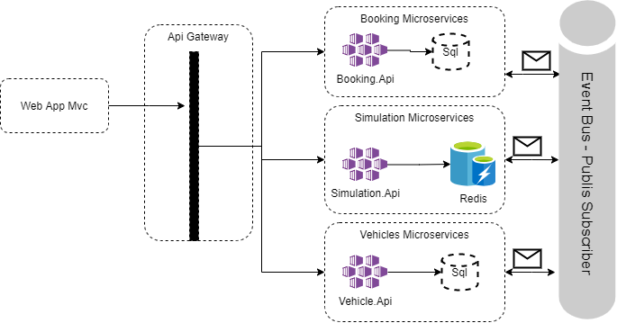
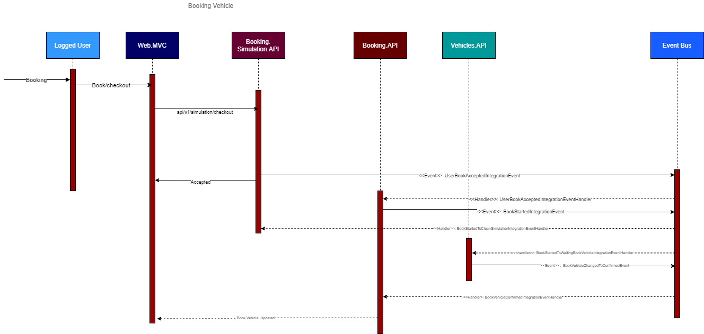

# .NET Microservices Localiza Booking

.NET Core Localiza Booking application, é um projeto baseado em microsserviços e containers docker.

## Getting Started

## Architecture overview

A arquitetura proposta é orientada a microsserviços indenpendentes, cada um com o seu modelo arquitetural. Foram utilizados vários mecanismos arquiteturais dentro de cada mecanismo, tais como Crud e padrões DDD. A arquitetura foi elaborado pra atender as comunicações assíncronas entre os vários microsserviços, baseados nos padrões de Event Bus e Eventos de integração.

### Overview de microsserviços

### Overview fluxo de reservas de veículos

